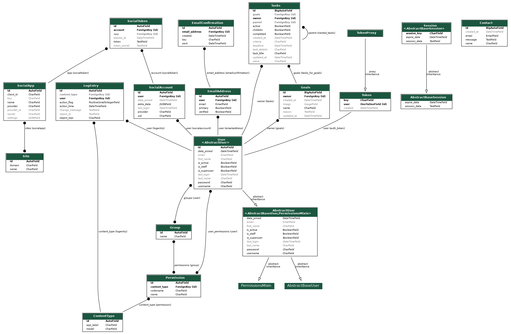

	
# Forge Focus
**Created By Jamie Connell**
**Student Of Code Institute 2024**

Forge Focus is a task management application that allows users to creatre, manage and orgasnise goals that they wish to acieve.
These goals can be everyday goals, or more spesific to a certain apect of the users live.

[Forge Focus Live App](https://forge-focus-pp5-467431862e16.herokuapp.com/)
[Forge Focus Live API](https://forge-focus-api-backend-83543ef108af.herokuapp.com/)
[Forge Focus Front End Repository](https://github.com/GreenNinjaBoy/forge-focus-pp5-frontend)

## Table of Contents
- [Design of the API](#Design-of-the-API)
- [API Features](#API-Features)
- [Future Features For API](#Future-Features-for-API)
- [Lanuages Used](#Lanuages-Used)
- [Frameworks and Libraries Used](#Frameworks-and-Linraries-used)
- [Tools and Technologies Used](#Tools-and-Technologies-Used)
- [Validatrion and Testing](#Validation-and-Testing)
- [Known Bugs and Fixes](#Known-Bugs-and-Fixes)
- [Deployment](#deployment)
    - [Cloning Repository](#Cloning-Repository)
        - [CodeAnywhere](#CodeAnywhere)
        - [GitPod](#Gitpod)
    - [Forking Repository](#Forking-Repository)
- [Connecting to this API](#Connecting-to-this-API)
- [Credits](#Credits)
- [Acknowledgements](#Acknoledgements)

## Design of the API

### Aim

The aim of the API is to store task data that includes setting areas to refine ("goals"), create tasks
which can be independantly worked on or linked to a main goal.

provide a full range of CRUD functionality to any linked applications.  

### Considerations when creating

The following were taken into consideration when creating the API 

1. User authentication will be included within the API, with read, update and delete functionality initially only available to the owner of the data. A Later function maybe added that will allow for access to be granted to team member users.

2. Secret keys etc. will be hidden and Debug set to False for the deployed API.

3. Only trusted URLs, specified directly within the API, will be able to make requests to the API and access any CRUD functionality.

## API Features

### Security Features

Only the following can be accessed by users who are not authenticated, all other endpoints of the API
can be accessed if a user has created an account and is authorised.

- The base root, This give the user a welcome message and a some information
- The /dj-rest-auth/registration/ endpoint, this will allow new users to register to the application.
- The /dj-rest-auth/login/ endpoint, which allows registered users to log in.

Only owners of a data instance can access any CRUD functionality related to it. All get requests
made by a user/owner will return a list with only the items belonging to that user/owner. 
Any requests made by a user/owner for a specific item that user/owner does not own will be denied.

### User Model
Users of the page can, Register, Login and Logout

| Field | Automatic/Required/Optional | Notes|
|--|--|--|
| Username| Required  | Must be Unique and cannot be same as already registered user|--|--|--|
| Email Address | Required | Must be unique and in correct format and cannot be already registered|--|--|--|
|Password |Required | Must pass complexity rules to prevent common or easily guessable passwords

Below are the endpoints for the user model
|URL| notes |
|--|--|
| dj-rest-auth/registration/ | register a new user account |
|dj-rest-auth/login/ | allow user to login |
|dj-rest-auth/logout/ | allow user to logout |

### Contact Model

Users can send messages to the admin of the Forge Focus site. the feilds
to be filled out are Name, Email Address and Message. These messages
can be viewed by the Admin (superuser) by means of the contact/list url.

Fields held within the database:

| Field | Automatic/required/optional | notes |
|--|--|--|
| created_at | Automatically Generated | DateTime
| name | required | text of max 50 characters |
| email | required | vaild email required |
| message | required | text |

## Goals Model
Users can store goals that they wish to work on this can be given a "reason", describing why they have set the goal and if they wish the user can upload an image to the goal.

Fields held within the database:
|Field| Automatic/required/optional | notes  |
|--|--|--|
| owner	 | Automatically Generated | Foreign key link to a user instance |
|created_at|Automatically Generated | DateTime
|updated_at|Automatically Generated | DateTime
|name| required | text of max 50 characters|
| reason |optional | text |
|image| default provided if non given| stored in cloudinary, only images smaller than 2mbs, height 4096 and width: 4096 will be accepted|

Extra fields generated and returned with a GET request:
 - is owner field, which will return true if the authorized user is the owner 

Endpoints for the goals model:
|URL| http request | notes
|--|--|--|
| goals/  | GET  | Returns a list of the user's goals ordered by created_at with with the most recently created listed first.
| goals/ | POST | Create a new goal |
| goals/id | GET | Get a specific goal using it's ID |
| goals/id | PUT | Update a goal |
| goals/id | PATCH | update a field within a goal |
| goals/id | DELETE | Delete a focus area using its ID |

### Tasks Model

Users can store tasks, these tasks can be independent or can be linked to a goal. They can be toggled as active or not.

Fields held within the database:

|Field| Automatic/required/optional | notes  |
|--|--|--|
| owner	 | Automatically Generated | Foreign key link to a user instance |
| goal | optional | Foreign key lined to a goal, input goal ID |
|created_at|Automatically Generated | DateTime
|updated_at|Automatically Generated | DateTime
|name| required | text of max 50 characters|
| reason |optional | text |
|image| default provided if non given| stored in cloudinary, only images smaller than 2mbs, height 4096 and width: 4096 will be accepted|

# Future Features For API

There are many future features that can be implimented with this application.

The following are some that were taken into consideration when developing this application.

1. **Team Collaboration**:
Implement a feature allowing users to grant access to their goals and tasks to team members, 
enabling collaborative work and shared progress tracking.

2. **Task Prioritization**: 
Add a priority field to the Tasks model, allowing users to rank their tasks by importance or urgency.

3. **Goal and Task Analytics**: 
Develop a dashboard that provides visual representations of goal progress, task completion rates, and productivity trends over time.

5. **Email Notifications**: 
Set up an email notification system to remind users of upcoming task deadlines or to provide weekly progress summaries.

7. **Integration with Calendar Apps**: 
Allow users to sync their tasks and goals with popular calendar applications like Google Calendar or Apple Calendar.

10. **Goal Templates**: 
Create a library of goal templates that users can choose from, helping them set up common goals more quickly.

11. **Time Tracking**: 
Add a time tracking feature to tasks, allowing users to log the time spent on each task and analyze their time management.

15. **Gamification Elements**: 
Introduce gamification features like achievement badges or a point system to increase user engagement and motivation.

These future features would significantly enhance the functionality and user experience of the Forge Focus application. This is providing a road map in which
I can use to further enhance the application.

#### **ERD**

 ERD 

This can be generated within the terminal by using the following commands:

1. Enter the following command: "pip install pip install django-extensions"
2. Within the 'INSTALLED_APPS' section of the settings.py ensure 'django_extensions', is present.
3. Enter the following command: "pip install pygraphviz"
4. Enter the following command: "./manage.py graph_models -a -g -o my_project_visualized.png"

Now a .png image will be generated from python showing you ERD.

# Technologies Used

## Languages
- Python

## Frameworks
- Django - Framework to build the app.
- Django REST framework - Toolkit for building the API

## Libraries, Python Packages and Programs Used
- Pillow - To process the image.
- Cloudinary - Used to store and serve images.
- Django filter - Used to filter API results.
- dj rest auth - Used with auth system.
- djangorestframework simple jwt - Used to create access tokens for authentication.
- dj database url - Used for the DATABASE_URL connection settings.
- Psycopg2 - Allows deployed application to perform CRUD on the db.
- Gunicorn - Used for deployment of WSGI applications.
- django cors headers - Used to allow cross origin resource sharing.
- Git - Used for version control.
- GitHub - Used to store the repository and GitHub projects for the Kanban board.
- GitPod - IDE used to develop the site.
- CodeInstituteSQL - Used for the database.
- Heroku - Used for hosting the site.

## Testing

Please refer to the following [TESTING.md](TESTING.md) for the tests that were carried out.

# Deployment

#### **Creating The Repository**

The repository was created using Github. as a student this was done using a template provided by Code Institute.
To do this the following steps were taken:

- On the browser head over to the [Code Institute Template](https://github.com/Code-Institute-Org/p3-template).
- Click on the green "Use this template button".
- Click on "create a new repository".
  
- The user will be taken to a new page to create the repository.
- In the box titled "repository name" enter an appropriate name (for this project Forge-Focus-BVackend-api was used).
- There is an optional description box if you wish to give a bit more detail to your repository.
- Then Click on the green "create repository" and Github will create the new repository.
  

### **Cloning the Repository**

- Github can also be used to clone a repository so that the code can be altered and pushed back to the main repository using a different IDE.
  - This can be done by using the following steps.

1.  In the "Forge-focus-backend-API" repository, select the green "code" tab.
2.  Select HTTPS in the dropdown menu.
3.  Copy the URL under HTTPS.

- There are 2 main virtual IDE's that CodeInstitiue reccomend and those are [CodeAnyWhere](app.codeanywhere.com) and [GitPod](gitpod.io).
- Please Note that the images used for CodeAnywhere were images used in a previous project entitled Story-time-Adventures-PP3 the process however remains the same.

Cloning Repository Using CodeAnywhere

	

1. Open the [CodeAnywhere](https://app.codeanywhere.com/).
2. Sign in using your Github details.

3. Click on the create new workspace button.

 7. Paste copied HTTPS and click create (Codeanywhere will now generate the virtual IDE).

4.  Once IDE has Loaded create inital index.html page and add test text.
5.  Once test text is added press `Ctrl + S` to save.
6.  Click terminal tab at top of screen and click new terminal.
7.  Once new terminal has opened test that content is being pushed back to github.
8.  In the terminal type `git add .` and press enter (this will add all new content).
9.  Then type `git commit -m "add test text"` and press enter (this lets anyone seeing your commits know what you have done).
10. Once you have done that type `git push` and press enter (this will push all changes made to the github repository).
11. Navigate to github.
12. Choose the repository you were working on.
13. Check the changes have been successfully pushed.

Cloning Repository Usining Gitpod

1. Open [GitPod](Gitpod.io)
2. Click the signin/ Login button at the top right hand corner of the page.
3. Sign/Login using your GitHub credentials.
4. Click on New Workspace
5. Gitpod works slightly different from Codeanywhere, you can either begin typing the name of your repository and you will see it appear in the dropdown menu or you can simply paste the copied HTTPS in to the field.
6. Click Continue and you Gitpod virtual workspace will be created.
7. Once IDE has Loaded create inital index.html page and add test text.
8. Once test text is added press `Ctrl + S` to save.
9. Click terminal tab at top of screen and click new terminal.
10. Once new terminal has opened test that content is being pushed back to github.
11. In the terminal type `git add .` and press enter (this will add all new content).
12. Then type `git commit -m "add test text"` and press enter (this lets anyone seeing your commits know what you have done).
13. Once you have done that type `git push` and press enter (this will push all changes made to the github repository).
14. Navigate to github.
15. Choose the repository you were working on.
16. Check the changes have been successfully pushed.

- ## **Please Note**
  - If for what ever reason you find yourself switching between CodeAnywhere or Gitpod please make sure that the first command in your terminal is **"git pull"** as this will pull
    any changes that you have made using other IDE's.

#### **Forking The Repository**

- Github can also be used to fork a repository. - This can create a copy of the repository which can be edited without effecting the main repository branch. - The steps to fork the repository can be done as follows: - When in the " Forge-Focus-Backend-API" repository click on the "Fork" tab located at the top right hand corner. - Click on "create a new fork" - You will be sent to another page to name your forked repository. - Once Named click create fork and you will have a copy of the repository that you can now access and change without affecting the original main repository.

 Fork Image 1 

Fork Image 2 

\*Please note that the images taken were from a friends Github repository who consented to the use of these images for educational purposes.

## CodeInstituteSQL

- Use the following [link]() to access code institutes SQL page.
- Enter you email addrexx.
- You will then be emailed a link which when opened will give you all your details to set up your database

## **Deploying Using Heroku**

The Forge-Focus_Backend-API repository was deployed using [Heroku.](https://id.heroku.com/login)

The following steps were used:

- Login or create an account with [Heroku](https://id.heroku.com/login)
- On the dashboard click on the "Create new app."
- Write a name for the app being deployed and choose your region and click "Create App".
- Add build pack scripts, the one used for this project was:
  - Python
- Connect your Heroku with your GitHub account and select the repository you are working on.
- In the ‘Settings’ tab, click on 'Reveal Config Vars’.
- Enter the details for these Variables (for this particular projectneed these variables in the ‘env.py’ file for local use):
- CLOUDINARY_URL
- DATABASE_URL (from [Code Institute]())
- SECRET_KEY (from Django)
- Then at the bottom of the deployed tab, you can either choose to deploy your repository manually or have the system do it for you automatically.

## Connecting to the front end application

The Following Steps were taken to ensure that the application connects to the front end application.

- Within Heroku, head over to the settings tab.
- Click on config variables
- Click add vairable
- Name Variable "CLIENT_ORIGIN"
- Within the key insert the URL from you front end application
- ensure this has saved
- Double check settings and ensure the following is in place
  - CORS_ALLOWED_ORIGINS = [
    os.environ.get('CLIENT_ORIGIN'), ]
- Ensure to save eveything and push your changes to your repository.
- Head over to your front end application 
- Within your Axios.Defaults.js file ensure you have the following
    - axios.defaults.baseURL = "URL-for-your-backend-application";
    - ensure to replace URL-for-your-backend-application with your actual URL.
- again ensure to save everything and push your front end changes to your front end repository.

Once you have done this then you have successfully connected both your repositories.

## **Creating The Django Project & App**

The following steps were taken to create the django Project and App:

Django Project

 - Within the terminal install django using the following command "pip3 install django".
 - Once installed run the following command to create your project: **django-admin startproject web_project .**
 	- *Note: replace "web_project" with your chosen app name, for this project "gem_places" was used.
  	- *Note: the command used with the use of the "." assumes that this is your created project and automatically creates the following files:
   		- Settings.py
     		- __init__.py
       		- asgi.py
         	- urls.py
          	- wsgi.py
- When this is done then imput the following command into the terminal python manage.py migrate.
	- When you run the server the first time, it will create a default SQLite database in the file db.sqlite2 that is intended for development purposes.

 This is the first stage when creating a project using django. 

Django App

To create the basic temnplate for the django app the following steps were taken.

- Within the termianl the follwing command was used "**python manage.py startapp appname**
	- Note* insert what ever you would like to call you app instead of "appname". For this app forfe_focus_api was used.
 	- When the command is running you app directory is created with some of the followign files inside.
  		- views.py
    		- urls.py
      		- models.py
        	- forms.py
         	- admin.py
     
This is now the basic structure installed and ready for you to begin work within your application/project.    	

 Creating Procfile 

Heroku web applications requires a Procfile for the application to run successfully and is done so usuing the following steps.

1. Run the following command within your terminal "pip install gunicorn"
2. create Procfile within your directiory.
3. Withing the procfile insert the following "web: gunicorn project_name.wsgi"
4. Push your changes to github.

Once you have re-deployed your app on heroku the Procfile will be updated within the reasourses section.

 requirements.txt 

To create the requirements.txt file the following command is inputted into the terminal "pip freeze > requirements.txt"

This will create your requirements.txt file with a list of the dependences required.

## Acknowledgements

This is my fith and final project that was created and developed for portfolio as a student of [Code Institute](https://codeinstitute.net/) currently undertaking their course in Full Stack Software Development. This as been a great achievement and I am proud to be a student of CodeInstitute.

I would like to thank the following for all of the support throughout the development phase.

- The Code Institute community, including fellow students and staff.
- My family, My friends and peers - There was a time where i was in a really difficult place which resulted in a leave of absence but with the help of my Wife, daughter and friends i was able to return an focus on my final project.
- My Mentor lauren-nicole Popich for her continuing advice and support during the development process. I can honestly say without her knowledge and guidence I would not be at the stage I am at now and her on going support especially during my difficult time earlier in this project has been nothing short of amazing.

Jamie Connell Code Institute Student 2024