# Testing and Validation

## Contents

[Code Validation](#code-validation)

[Manual Testing](#manual-testing)

[Automated Testing](#automated-testing)

---

## Code Validation

All code has been passed through the Code Institute Python Linter.
The images below show the results for each.

### Contact

models.py

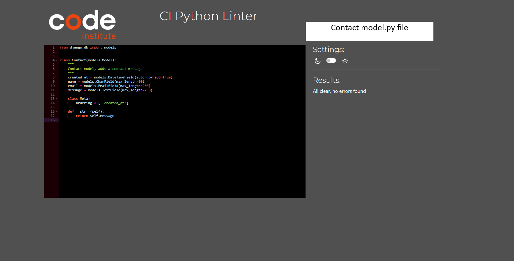

serializers.py

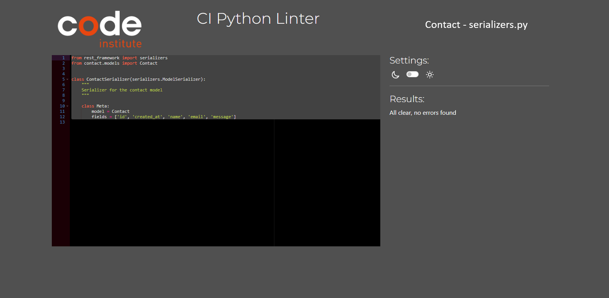

urls.py

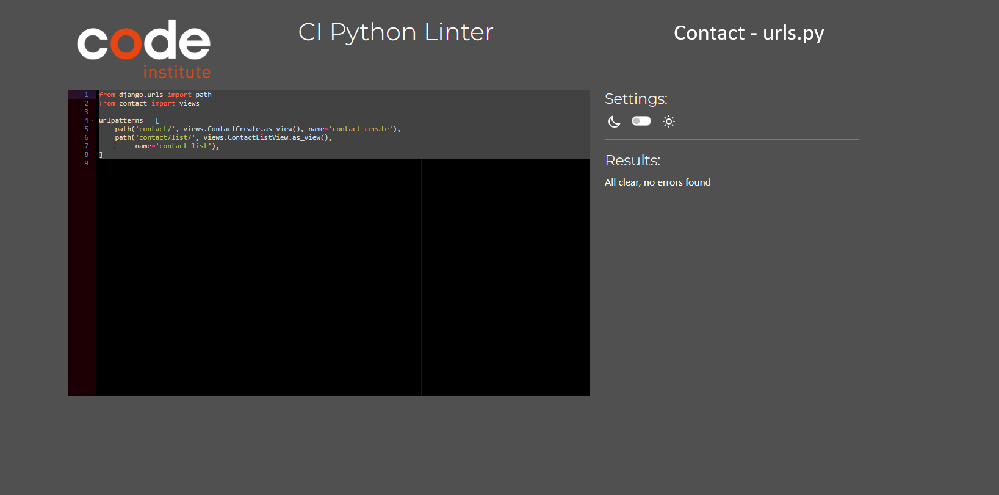

views.py

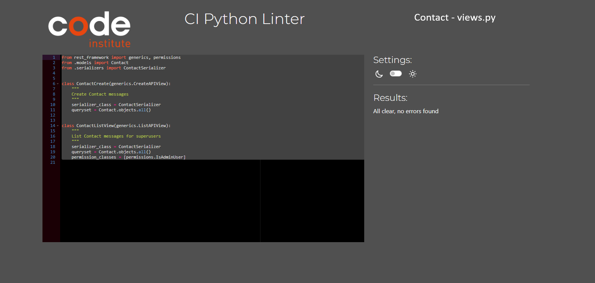

### Goals

models.py

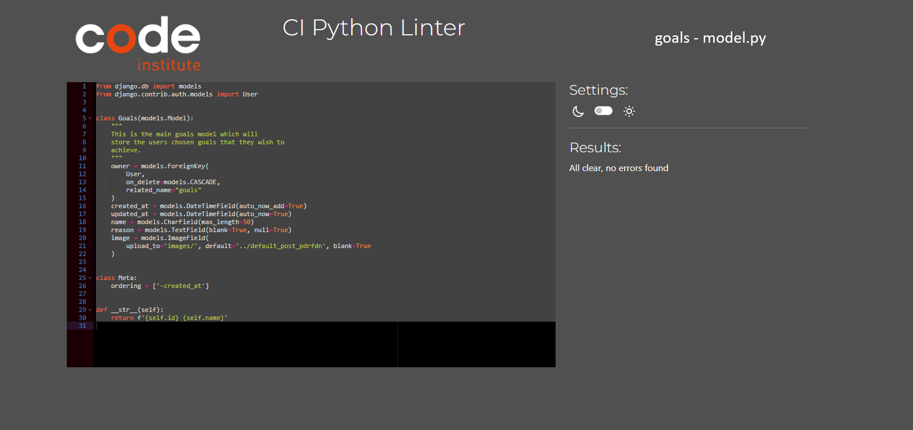

serializers.py

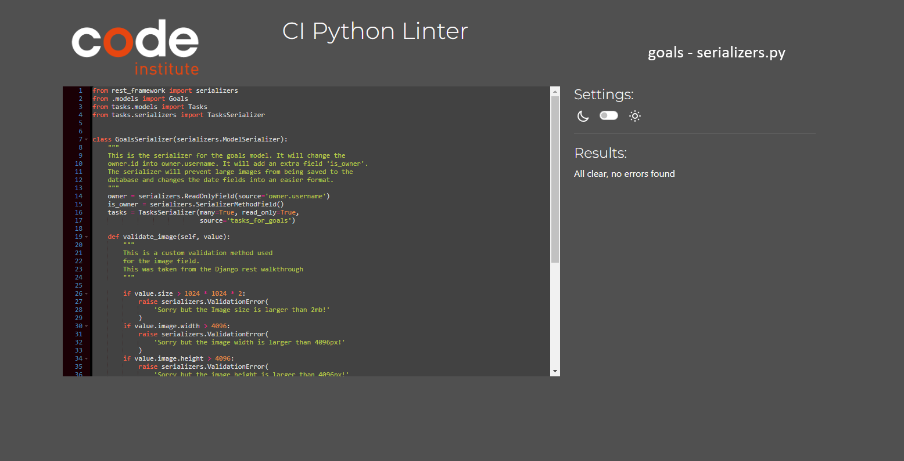

urls.py

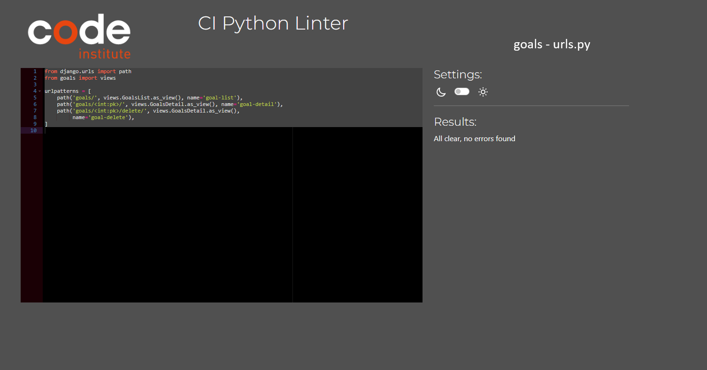

views.py

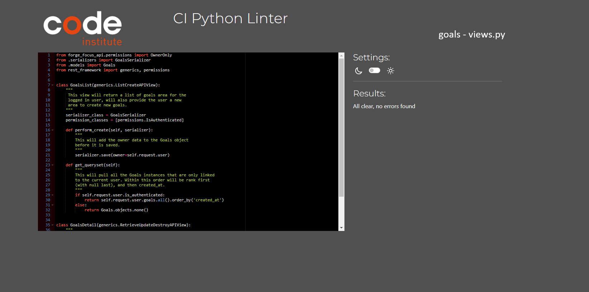

### Tasks

models.py

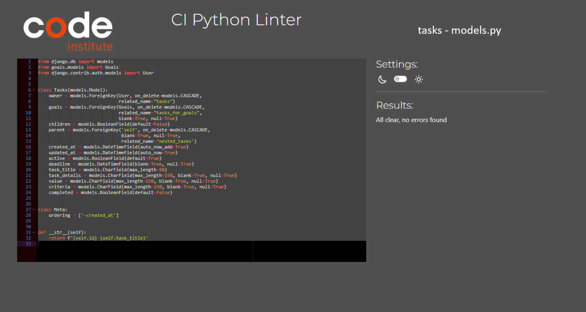

serializers.py

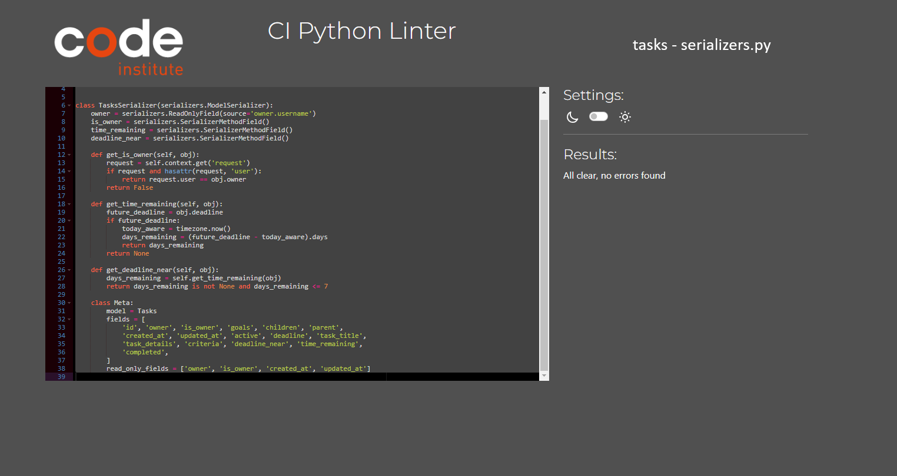

urls.py

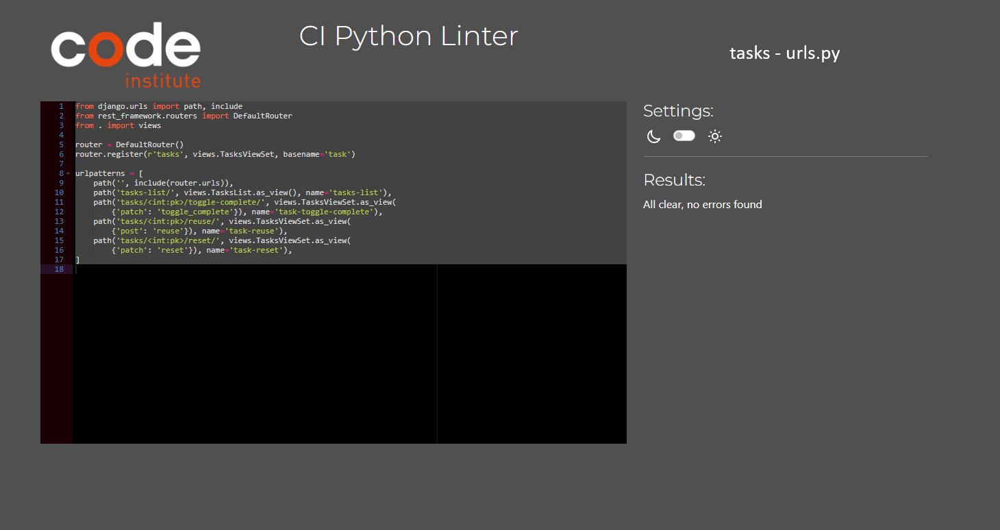

views.py

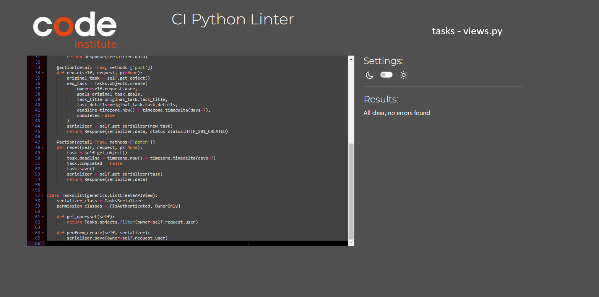

