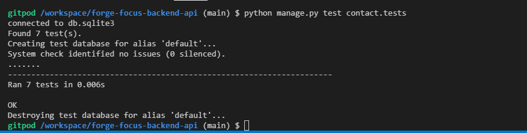
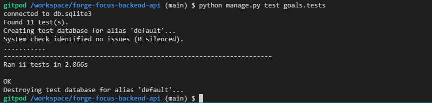

# Testing and Validation

## Contents

[Code Validation](#code-validation)

[Manual Testing](#manual-testing)

[Unit Testing](#unit-testing)

---

## Code Validation

All code has been passed through the Code Institute Python Linter.
The images below show the results for each.

### Contact

models.py

serializers.py

urls.py

views.py

### Goals

models.py

serializers.py

urls.py

views.py

### Tasks

models.py

serializers.py

urls.py

views.py

## Manual Testing

### Authorisation

| url | http request | expected outcome | result | Frontend |
| --- | --- | --- | --- | --- |
| dj-rest-auth/registration/ | POST | New user created | PASS | PASS |
| | | Invalid fields handled | PASS | PASS |
| dj-rest-auth/login/ | POST | User Authenticated | PASS | PASS |
| | | Invalid fields handled | PASS | PASS |
| dj-rest-auth/logout/ | POST | User logged out and token object deleted | PASS | PASS |

### Goals model

| url | http request | expected outcome | result |Frontend |
| --- | --- | --- | --- | --- |
| goals/ | GET | Unauthorized error for logged out users | PASS | Handled by frontend logic |
| | | list of all logged in user's goals and non of anyone elses | PASS | PASS |
| | | goal areas ordered by rank first and then by created_at in ascending order | PASS | Rank not utilised, but passes on ordering by ascending created_at |
| | POST | Unauthorized error for logged out users | PASS | Handled by frontend logic |
| | | Error message for empty name field | PASS | PASS |
| | | Error message for name over 50 characters | PASS | PASS |
| | | Error message for images too large | PASS | PASS |
| | | new focus created for logged in user | PASS | PASS |
| goals/<int:pk> | GET | Invalid goals request returns 404 | PASS | PASS |
| | | Logged in user can get their goals | PASS | PASS |
| | | Logged in user trying to get a goal that doesn't belong to them returns 403 error | PASS | PASS |
| | | Logged out user cannot make get request 401 error | PASS | PASS |
| | PUT | Logged in user can edit their goal | Fail in deployed API | PASS |
| | PATCH | Logged in user can edit their goal | Fail in deployed API | PASS |
| | DELETE | Logged in user can delete their goal | Fail in deployed API | PASS |

Key notes:
The endpoints which fail in deployed api do work when accessed from the frontend. The same issue was also found in the walkthrough api.

### Tasks model

| url | http request | expected outcome | result |Frontend |
| --- | --- | --- | --- | --- |
| task/ | GET | Unauthorized error for logged out users | PASS | Frontend logic already prevents this |
| | | list of all logged in user's tasks and non of anyone elses | PASS | Tasks are only ever retrieved by also using goal_id reference |
| | | task ordered by deadline first and then by created_at in ascending order | PASS | PASS |
| tasks/?parent=None | GET | list of all user's tasks which don't have a parent | PASS | Unused endpoint |
| tasks/?parent_id=<> | GET | list of all user's tasks which are nested in parent given | PASS | Unused endpoint |
| tasks/?goal_id=<> | GET | list of all user's tasks with goal given | PASS | PASS |
| tasks/?goal_id=<>&parent=None | GET | list of all user's tasks with goal given and which don't have a parent | PASS | Unused end point |
| | POST | Unauthorized error for logged out users | PASS | Handled by frontend logic |
| | | Error message for empty title field | PASS | PASS |
| | | Error message for name over 50 characters | PASS | PASS |
| | | new task created for logged in user | PASS | PASS |
| task/<int:pk> | GET | Invalid tasks request returns 404 | PASS | Unused endpoint |
| | | Logged in user can get their tasks | PASS | Unused endpoint |
| | | Logged in user trying to get a tasks that doesn't belong to them returns 403 error | PASS | Unused endpoint |
| | | Logged out user cannot make get request 401 error | PASS | Unused endpoint |
| | PUT | Logged in user can edit their tasks | Fail in deployed API | PASS |
| | PATCH | Logged in user can edit their tasks | Fail in deployed API | PASS |
| | DELETE | Logged in user can delete their tasks | Fail in deployed API | PASS |

Key notes:
The endpoints which fail in deployed api do work when accessed from the frontend. The same issue was also found in the walkthrough api.

## Unit Tests for Django Models

This project uses Django's built-in testing framework to ensure the integrity and functionality of the data models. Test suites for each of the main models: Contact, Goals, and Tasks.

**Test Creation Process**

Test File Structure: 
For each model, a seperate test file was created tests.py within each apps respective directory.

Test Case Classes: 
Within each test file, a test case class was defined (e.g., TestTasksModel) that inherits from django.test.TestCase.

Setup Method: 
A setUp method was implemented to create necessary objects (like test users or related model instances) that are used across multiple tests.

Individual Test Methods: Individual test methods were written for different aspects of each model:

Basic object creation and field values
String representation (__str__ method)
Field constraints (max length, blank/null properties)
Default values
Relationships between models
Ordering
Cascade deletion behavior
Auto-update fields (like updated_at)

Edge Cases: Tests for edge cases and potential error conditions were included to ensure robust error handling.

Database Interactions: The tests interact with a test database, to test database operations without affecting the production database.

**Running Tests**
 
 Below you will find each code that was used to run the individual test.py files and their outcome.

 

 
 
python manage.py test contact.tests

 

 
 

  

 
 
python manage.py test goals.tests

 
 
 
 

  

 
 
python manage.py test tasks.tests

 
 
 
 

